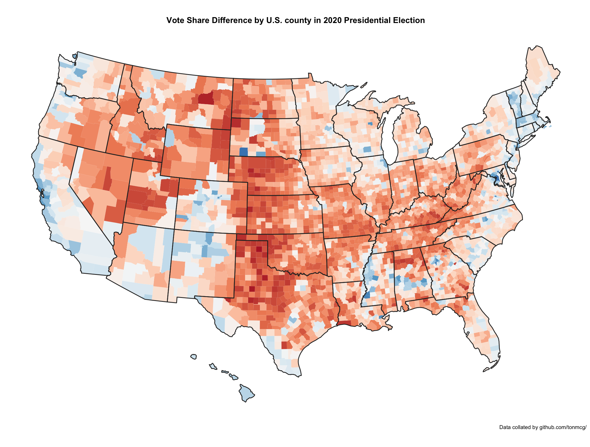

Data Visualization
======================

QMSS GR5063 - Columbia University
--------------------------------

**Spring 2021**  
**Lecture: Mondays 8.10 - 10pm (but see weekly schedule)**  

**TA: Yifei Dong [yd2564@tc.columbia.edu](yd2564@tc.columbia.edu)**
  + Office Hours: Friday 8.30 - 9.40am EST
  + Section: Wednesday 20.00 - 21.00pm EST

This is a repo for TA Review Section materials. Please let me know if you have any
questions, you can simply raise questions by opening issues under this repo.

**Spatial Data and Maps**

#### Choropleth Map
Choropleth map displays divided geographical areas or regions that are colored, shaded,
or patterned in relation to a data variable. In the filed of political science, choropleth maps have been frequently used in election analysis.

Below is an example that I made to compare 2018 local election and 2020 presidential election results in Taiwan Kaohsiung City.

Han Kuo-yu, the candidate of Chinese Nationalist Party (KMT, blue-colored), defeated his opponent Chen Chi-mai, the candidate of Democratic Progressive Party (DPP, green-colored), and was elected as Mayor of Kaohsiung in 2018's Taiwan local election. His victory was unexpected and surprising because Kaohsiung has long been considered as DPP's stronghold, and the last time KMT hold the Kaohsiung mayor position was 1998, almost 20 years ago.

However, soon after Han took office as mayor, his supporters, also known as 'Han fans', prod him to run for 2020 Presidential Election. Han initially refused calls for him to contest KMT primary election but later joined, and won party's nomination. Many Kaohsiung residents were infuriated by Han's failure to keep his 2018 campaign promises and his decision to seek presidency. As you could see from the map, Han lost almost all of the regions he won in Kaohsiung in just 2 years.

After Han lost presidential race, a recall movement started in Kaohsiung. 939,070 Kaohsiung residents voted in favor of recalling Han (more than the votes Han received when he was elected as mayor in 2018, which was 892,545) and Han became the first elected official to be recalled in Taiwan's democratic history.

Another great example is U.S election. I made two choropleth maps, which both presents the 2020 U.S Presidential Election results. The first one is state-level and the second one is the county-level results.

Many people are familiar with the first map because various TV channels and websites use it to cover the election night. The states are colored either in red or blue to indicate whether a majority of their voters voted for GOP candidate Donald Trump or Democratic candidate, Joe Biden. As you may see there is significantly more blue on this map. However, this map is not accurate because in some states, the election result are much closer than you might think.

Nevertheless, if we look at the second map, it indeed shows an opposite pattern compared to the first one. The red areas appear overwhelmingly in the majority of areas. For people who are not familiar with American politics, if we show this map to them, they may assume GOP won the election.

Now we know those two typical election maps are all somewhat misleading but they both presents the real data. Why people still use them? One of the major reasons is that they are so visually attractive.

Other questions you may raise in regarding to those two maps is that we only use two colors to fill every county, indicating the winner of each country. Nevertheless, this is also misleading because it assumes every voter in the county votes the same way. In reality, we know that each county contains both GOP supporters and Democratic Party supporters and by using two colors on the map, we lose a lot of information. For instance, we may care about which county went strongly for one candidate or the other , it is highly likely the voters are relatively evenly split in that county. When we face such an issue, a better way is to present the vote share difference (or net share) in the map like this:

  

If you are interested in election maps, please read this [article](https://www.washingtonpost.com/graphics/politics/2016-election/how-election-maps-lie/).

**Final Project Example**

I made a sample data visualization report using R Shiny. You can access this project [Gapminder Visualization](https://rodericktung.shinyapps.io/gapminder_shiny/). Please notice that the dataset and this site exists for the
purposes of education and making Shiny App examples. I do not update the dataset. If
you want to do actual research, please refer to the [Gapminder website](https://www.gapminder.org/) and review the way it takes to estimate those statistics. All errors are my own.

Generally speaking, you should try to integrate as many as functionalities into your
Shiny app. For example, below is a bubble chart that you may have been seen before in Prof. Hans Rosling's [TED Talk](https://www.ted.com/talks/hans_rosling_the_best_stats_you_ve_ever_seen). However, it is a static plot. Try to think about making it interactive!

